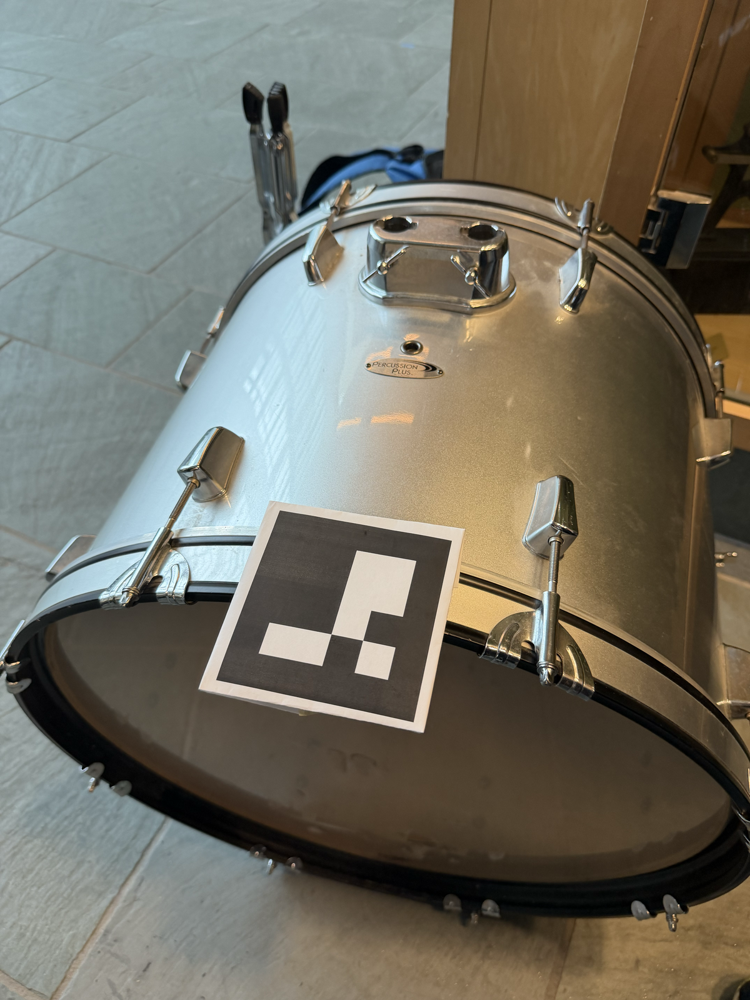
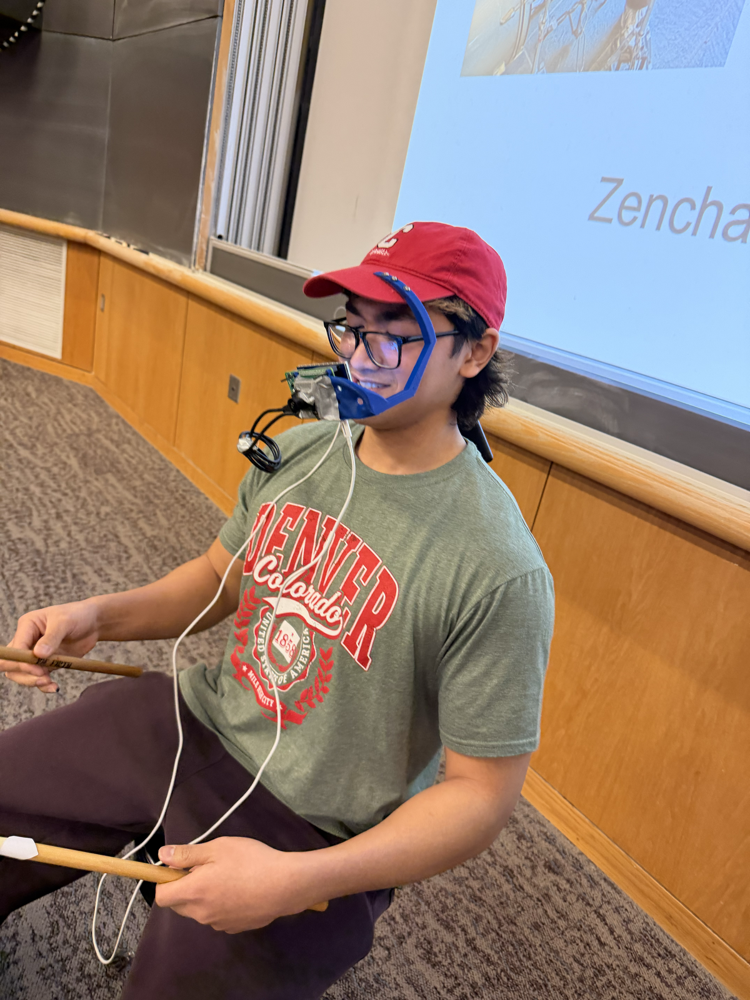

<p align="center">
  
</p>

# Groovy

Groovy is an augmented-reality drum trainer and rhythm game built for Cornell Make-a-thon, where we won first place out of 200+ participants.

[Watch demo on YouTube](https://youtu.be/zjiVDPzzH5k)

[Project Showcase Slides](https://docs.google.com/presentation/d/1VEii3qQU3IHkCzzPa4qKamzmnG5vukazkuBamYzn3ro/edit?usp=sharing)

## What Groovy Does
- Renders realtime 3D drum guides from ArUco marker pose estimation.
- Tracks up to two green drum sticks and maps hits from camera data only.
- Supports `play`, `train`, and `score` gameplay modes.
- Connects mobile app controls to CV runtime through backend + WebSocket bridge.

## Repo Layout
- `CV/`: OpenCV runtime (rendering, marker tracking, stick tracking, scoring UI).
- `Pi/`: WebSocket bridge that receives beatmaps/speed and launches `CV/main.py`.
- `App/backend/`: Flask API for uploads, beatmap selection, speed selection, and Pi forwarding.
- `App/frontend/`: Expo React Native app for song selection/upload and speed control.
- `Audio/`: beatmaps + conversion/preview utilities.
- `Etc/`: reserved scratch/support area.

## Quick Start (CV Only)
Install runtime deps:

```bash
python3 -m pip install --upgrade pip
python3 -m pip install opencv-contrib-python numpy
```

Run in score mode with stick tracking:

```bash
python3 CV/main.py --mode score --stick-track --stick-debug
```

Controls:
- `s` start
- `r` reset
- `q` or `Esc` quit
- `n` skip chord (train mode only)

## End-to-End Run (Frontend -> Backend -> Pi -> CV)
1. Set Pi address in `App/backend/app.py` (`PI_IP`).
2. Set backend URL in `App/frontend/app/(tabs)/index.tsx` (`BACKEND_BASE`).
3. Start the Pi bridge:

```bash
python3 Pi/pi_ws_server.py
```

4. Start backend:

```bash
python3 App/backend/app.py
```

5. Start frontend:

```bash
cd App/frontend
npm install
npm run start
```

Note: frontend speed selection is always sent as `notes_at_a_time` and is the final speed choice for both hardcoded songs and uploaded MP3s.

## Detailed Docs
- CV runtime: `CV/README.md`
- App stack (frontend/backend): `App/README.md`
- Frontend-only notes: `App/frontend/README.md`
- Audio tools: `Audio/ReadMe.md`


## Media

<p align="center">
  
</p>
<p align="center">
  
</p>
<p align="center">
  
</p>
